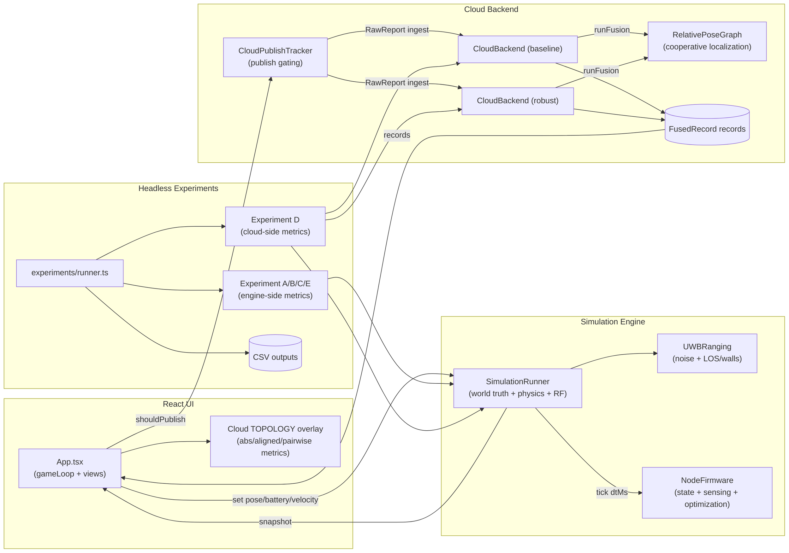
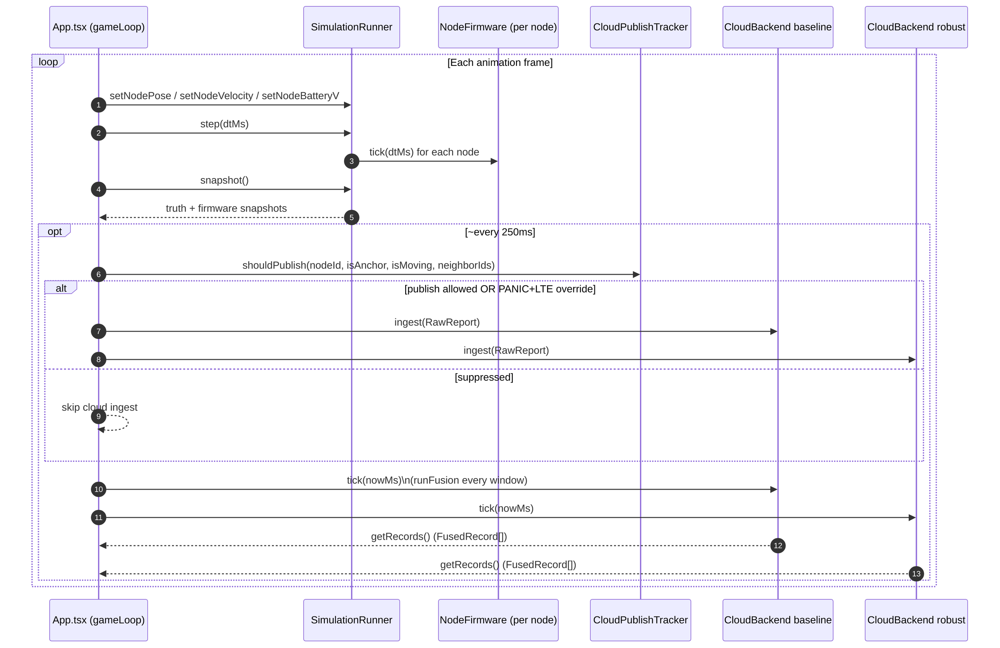
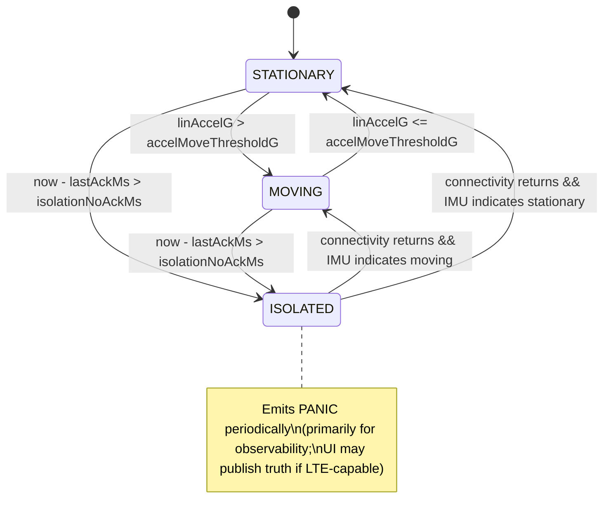
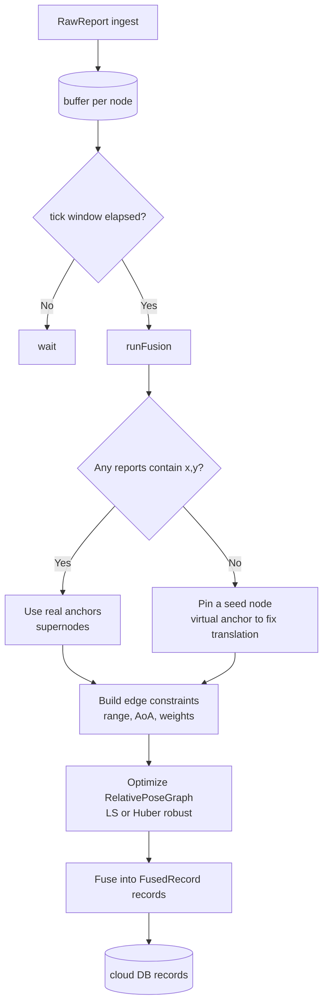
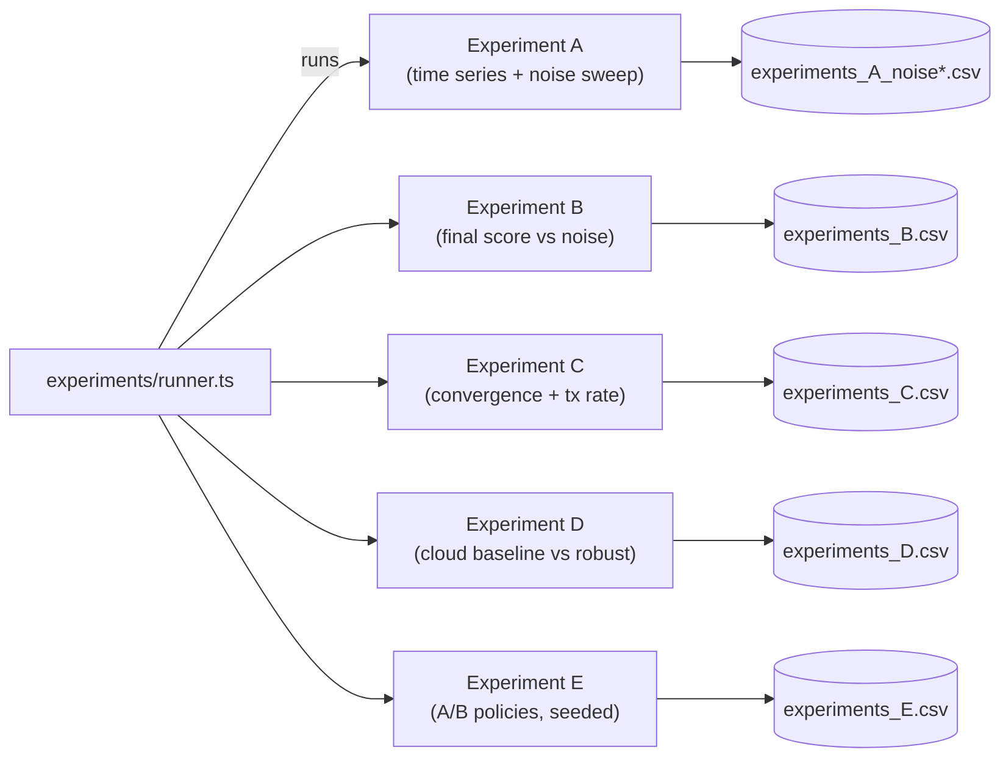

# ICUM-SIM System Diagrams

These diagrams describe the _central_ control-flow and data-flow in the simulator.

## 1) End-to-end data flow (UI + engine + cloud + experiments)

## 2) UI simulation + cloud publish loop (sequence)

## 3) Firmware state machine (movement + isolation)

## 4) Cloud fusion pipeline (high level)

## 5) Experiments pipeline (A–E)

