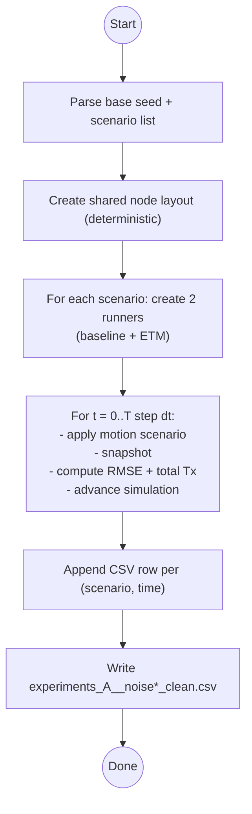
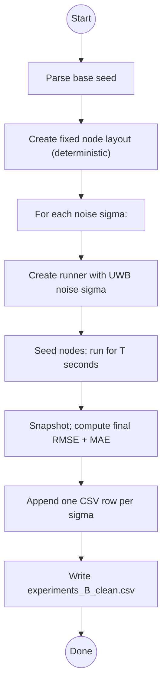
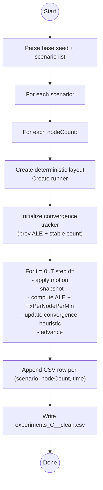
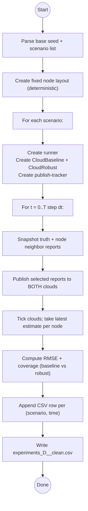
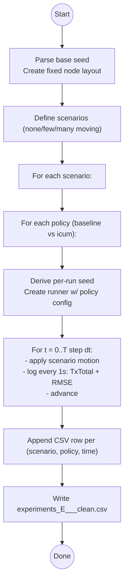

# Experiments

This folder contains the headless experiment runner used to generate CSV outputs for plots/tables.

- Entry point: `src/experiments/runner.ts`
- Run: `npm run experiments -- --seed=1`
- Output (written to the repo root):
  - Experiment A: `experiments_A_<scenario>_noise<xx.xx>_clean.csv`
  - Experiment B: `experiments_B_clean.csv`, `experiments_B_raw_clean.csv`, `experiments_B_summary_clean.csv`
  - Experiment C: `experiments_C_<scenario>_clean.csv`
  - Experiment D: `experiments_D_<scenario>_clean.csv`
  - Experiment E: `experiments_E_<scenario>_<policy>_clean.csv`

All experiments are deterministic given the same seed. The seed is taken from (highest priority first):

1. CLI: `--seed=123` or `--seed 123`
2. Env var: `EXPERIMENT_SEED=123`
3. Default: `1`

## Shared assumptions

- Units: meters, seconds.
- World bounds: `EXPERIMENT_WORLD_BOUNDS_M` in `src/experiments/lib/types.ts` (currently 0–50 m in X/Y).
- Default UWB distance noise (unless a sweep overrides it): `uwbNoiseSigma = 0.05` meters.
- In experiments, `uwbNoiseSigma = 0` is treated as a "perfect channel": `packetLoss = 0` and `uwbAngleNoiseStdRad = 0`.
- Motion scenarios: `none_moving`, `few_moving`, `many_moving`.
  - Motion is applied only during a fixed window (see `MOTION_START_MS` / `MOTION_STOP_MS` in `src/experiments/lib/types.ts`).
  - Motion is injected deterministically via `applyMotionScenario(...)` (`src/experiments/lib/motion.ts`).

### Motion window parameters

- Motion start: `MOTION_START_MS = 120_000` (120 s)
- Motion stop: `MOTION_STOP_MS = 180_000` (180 s)

The experiments that use the shared motion helper only change velocities exactly at these timestamps.

## Where each experiment lives

Each experiment is implemented in its own file under `src/experiments/experiments/`.

### Experiment A — Baseline vs ETM over time

- Implementation: `src/experiments/experiments/experimentA.ts`
- CSV: `experiments_A_<scenario>_noise0.00_clean.csv`, `experiments_A_<scenario>_noise0.05_clean.csv`, `experiments_A_<scenario>_noise0.20_clean.csv`

Clean columns (recommended for reports)

- `scenario`
- `time_s`
- `baseline_tx_total`
- `baseline_tx_per_node_per_min`
- `baseline_rmse_aligned_m`: RMSE after best-fit rigid alignment to truth (anchor-free)
- `baseline_mae_aligned_m`: MAE after best-fit rigid alignment to truth (anchor-free)
- `icum_tx_total`
- `icum_tx_per_node_per_min`
- `icum_rmse_aligned_m`
- `icum_mae_aligned_m`

This is the main time-series comparison of “periodic baseline” vs “event-driven” policies.

Parameters used

- Node count: 10
- World bounds: `EXPERIMENT_WORLD_BOUNDS_M`
- UWB distance noise sweep: `uwbNoiseSigma ∈ {0.00, 0.05, 0.20}` m
- Duration: 600 s
- Sampling/log cadence: 1,000 ms (one CSV row per second)
- Simulation stepping: `step(logEveryMs)` (i.e., time advances in 1,000 ms chunks)
- Scenarios: `none_moving`, `few_moving`, `many_moving`
- Baseline firmware policy:
  - `eventDrivenSensing = false`
  - `helloIntervalMovingMs = 2000`, `helloIntervalIdleMs = 2000`
  - `rangingIntervalMovingMs = 2000`, `rangingIntervalIdleMs = 2000`
  - `neighborTimeoutMs = 5000`
- ETM/ICUM firmware policy:
  - `eventDrivenSensing = true` (other firmware parameters use defaults)

### Experiment B — Noise sweep (final accuracy)

- Implementation: `src/experiments/experiments/experimentB.ts`
- CSV: `experiments_B_clean.csv`
- Raw per-seed: `experiments_B_raw_clean.csv`
- Summary (uncertainty): `experiments_B_summary_clean.csv`

This is a simple sweep over measurement noise to show sensitivity.

Notes

- `experiments_B_clean.csv` is the **aggregated** curve (median over multiple RNG seeds per noise sigma).
- `experiments_B_raw_clean.csv` contains the **raw per-seed** rows (useful for error bars).
- `experiments_B_summary_clean.csv` contains **median + IQR** and **mean + 95% CI** for key metrics per noise sigma.

Parameters used

- Node count: 8
- World bounds: `EXPERIMENT_WORLD_BOUNDS_M`
- Duration: 300 s
- UWB distance noise sweep (`uwbNoiseSigma` in meters): 0.1, 0.2, 0.3, 0.4, 0.5, 0.6, 0.7, 0.8, 0.9, 1.0, 1.5, 2.0, 3.0, 4.0, 5.0
- Run mode: `runFor(simSeconds)` (uses the engine's default internal timestep)

### Experiment C — Scaling and convergence

- Implementation: `src/experiments/experiments/experimentC.ts`
- CSV: `experiments_C_<scenario>_clean.csv`

Clean columns (recommended for reports)

- `scenario`
- `time_s`
- `node_count`
- `tx_per_node_per_min`
- `ale_aligned_m`: anchor-free ALE (rigid-aligned to truth)
- `convergence_stable_ms`: first time the stability heuristic triggers
- `t_eps_ms`: first time the rolling-mean error stays <= `--convEps`

Parameters used

- World bounds: `EXPERIMENT_WORLD_BOUNDS_M`
- UWB distance noise: `uwbNoiseSigma = 0.05` m
- Duration per run: 300 s
- Sampling/log cadence: 1,000 ms
- Simulation stepping: `step(logEveryMs)` (1,000 ms chunks)
- Scenarios: `none_moving`, `few_moving`, `many_moving`
- Node-count sweep: 5, 10, 20, 35, 50
- Convergence heuristic:

  - Uses anchor-free ALE: rigidly aligns estimated positions to truth (rotation+translation) before scoring
  - Computes a rolling 30-second mean of aligned ALE
  - Declares convergence when the rolling mean stabilizes: `|mean(t)-mean(t-1s)| ≤ 0.05 m` for 5 consecutive seconds

- Time-to-threshold convergence (`T_eps_ms`):
  - Uses the same rolling-mean ALE as above
  - Declares convergence when `mean(t) ≤ convEps` for `convHold` consecutive samples
  - Tweak via CLI args to `npm run experiments`:
    - `--convEps=<meters>` (default `1.0`)
    - `--convHold=<samples>` (default `5`, with 1s sampling => seconds)
    - `--convWindow=<seconds>` (default `30`)

### Experiment D — Cloud fusion baseline vs robust

- Implementation: `src/experiments/experiments/experimentD.ts`
- CSV: `experiments_D_<scenario>_clean.csv`

Clean columns (recommended for reports)

- `scenario`
- `time_s`
- `node_count`
- `cloud_baseline_rmse_m`
- `cloud_robust_rmse_m`
- `coverage_baseline_nodes`
- `coverage_robust_nodes`

Parameters used

- Node count: 12
- World bounds: `EXPERIMENT_WORLD_BOUNDS_M`
- UWB distance noise: `uwbNoiseSigma = 0.05` m
- Duration: 300 s
- Sampling/log cadence: 1,000 ms
- Simulation stepping: `step(logEveryMs)` (1,000 ms chunks)
- Scenarios: `none_moving`, `few_moving`, `many_moving`
- Cloud publish policy:
  - `CloudPublishTracker({ staleMs: 30_000 })`
  - Publishes the same node report to both clouds when `shouldPublish(...)` returns true
- Cloud settings:
  - Baseline cloud: `CloudBackend({ robustFusion: false })`
  - Robust cloud: `CloudBackend({ robustFusion: true })`
  - Both clouds use deterministic RNG (`createMulberry32(...)`) so results are repeatable
- Report contents (per node per tick):
  - `battery = 100`
  - `status`: maps firmware `ISOLATED` to `STATIONARY`, otherwise uses firmware `MOVING|STATIONARY`
  - Neighbor observations: `{ id, range, aoa }` from firmware neighbor table

### Experiment E — Compact A/B runner across scenarios

- Implementation: `src/experiments/experiments/experimentE.ts`
- CSV: `experiments_E_<scenario>_<policy>_clean.csv`

Clean columns (recommended for reports)

- `scenario`
- `policy`
- `seed`
- `time_s`
- `tx_total`
- `tx_per_node_per_min`
- `rmse_m`

Experiment E is a “small harness” that’s useful for quick sanity checks and regression comparisons.

Parameters used

- Node count: 10
- World bounds: `EXPERIMENT_WORLD_BOUNDS_M`
- UWB distance noise: `uwbNoiseSigma = 0.05` m
- Duration: 300 s
- Simulation timestep: `dtMs = 250` ms
- Sampling/log cadence: `logEveryMs = 1000` ms
- Policies:
  - `baseline`: periodic (`eventDrivenSensing = false`) with 2,000 ms HELLO/RANGING intervals and `neighborTimeoutMs = 5000`
  - `icum`: event-driven (`eventDrivenSensing = true`) with other parameters at defaults
- Motion injection (note: Experiment E uses an inline scenario function, not `applyMotionScenario`):
  - `few_moving`: nodes 2–4 move from 120–180 s with fixed velocities
  - `many_moving`: nodes 2–8 move from 120–180 s with fixed velocities

## Adding a new experiment

1. Create a new file under `src/experiments/experiments/experimentX.ts` exporting `runExperimentX()`.
2. Wire it into `src/experiments/runner.ts` and add a new CSV output (keep headers stable if you expect downstream scripts).
3. Prefer using shared helpers from `src/experiments/lib/` (seed parsing, layouts, motion injection, metrics, CSV writing).
