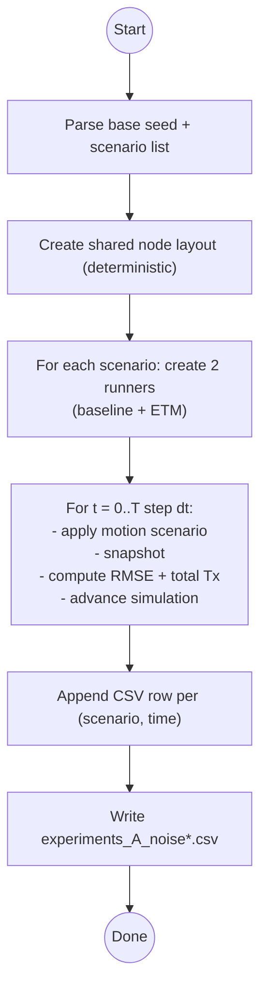
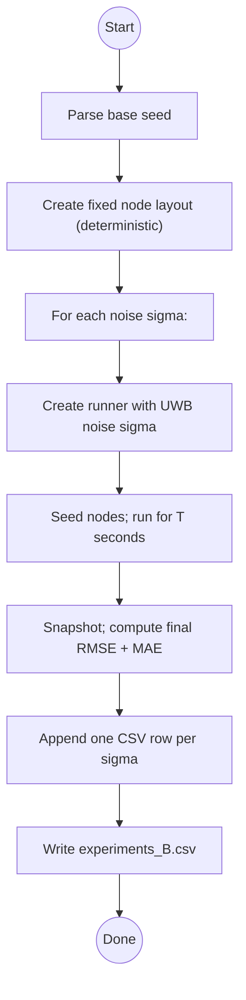
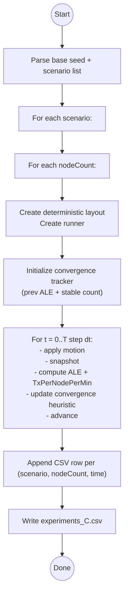
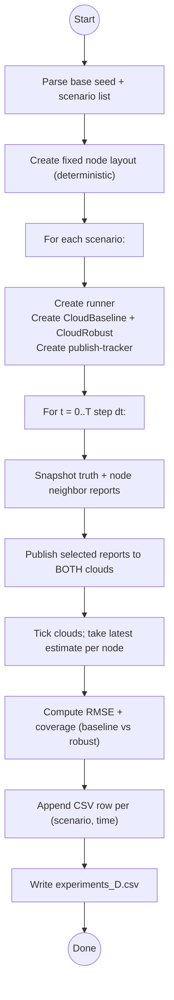
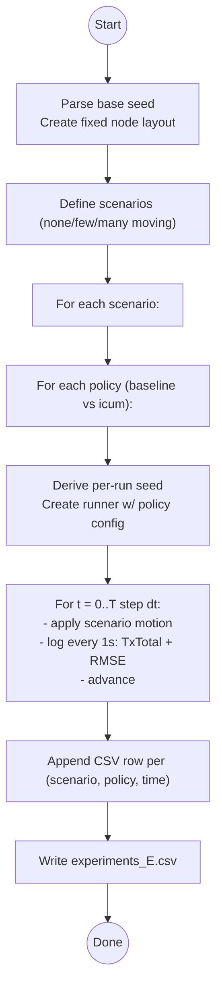

# Experiments

This folder contains the headless experiment runner used to generate CSV outputs for plots/tables.

- Entry point: `src/experiments/runner.ts`
- Run: `npm run experiments -- --seed=1`
- Output: `experiments_A_noise*.csv`, `experiments_B.csv` … `experiments_E.csv` (written to the repo root)

All experiments are deterministic given the same seed. The seed is taken from (highest priority first):

1. CLI: `--seed=123` or `--seed 123`
2. Env var: `EXPERIMENT_SEED=123`
3. Default: `1`

## Shared assumptions

- Units: meters, seconds.
- World bounds: `EXPERIMENT_WORLD_BOUNDS_M` in `src/experiments/lib/types.ts` (currently 0–50 m in X/Y).
- Default UWB noise (unless a sweep overrides it): `uwbNoiseSigma = 0.05` meters.
- Motion scenarios: `none_moving`, `few_moving`, `many_moving`.
  - Motion is applied only during a fixed window (see `MOTION_START_MS` / `MOTION_STOP_MS` in `src/experiments/lib/types.ts`).
  - Motion is injected deterministically via `applyMotionScenario(...)` (`src/experiments/lib/motion.ts`).

### Motion window parameters

- Motion start: `MOTION_START_MS = 120_000` (120 s)
- Motion stop: `MOTION_STOP_MS = 180_000` (180 s)

The experiments that use the shared motion helper only change velocities exactly at these timestamps.

## Where each experiment lives

Each experiment is implemented in its own file under `src/experiments/experiments/`.

### Experiment A — Baseline vs ETM over time

- Implementation: `src/experiments/experiments/experimentA.ts`
- CSV: `experiments_A_noise0.00.csv`, `experiments_A_noise0.05.csv`, `experiments_A_noise0.20.csv`
- Columns:
  - `Scenario`: motion scenario
  - `Time`: seconds
  - `Baseline_Tx`: cumulative transmissions (sum over all nodes)
  - `Baseline_RMSE`: firmware position RMSE vs truth (all nodes)
  - `ETM_Tx`, `ETM_RMSE`: same metrics for event-driven (ETM/ICUM-style) sensing
  - Also emitted (paper-friendly, anchor-free): `*_MAE`, `*_RMSE_Aligned`, `*_MAE_Aligned`, `*_PairwiseDist_MAE`

This is the main time-series comparison of “periodic baseline” vs “event-driven” policies.

Parameters used

- Node count: 10
- World bounds: `EXPERIMENT_WORLD_BOUNDS_M`
- UWB distance noise sweep: `uwbNoiseSigma ∈ {0.00, 0.05, 0.20}` m
- Duration: 600 s
- Sampling/log cadence: 1,000 ms (one CSV row per second)
- Simulation stepping: `step(logEveryMs)` (i.e., time advances in 1,000 ms chunks)
- Scenarios: `none_moving`, `few_moving`, `many_moving`
- Baseline firmware policy:
  - `eventDrivenSensing = false`
  - `helloIntervalMovingMs = 2000`, `helloIntervalIdleMs = 2000`
  - `rangingIntervalMovingMs = 2000`, `rangingIntervalIdleMs = 2000`
  - `neighborTimeoutMs = 5000`
- ETM/ICUM firmware policy:
  - `eventDrivenSensing = true` (other firmware parameters use defaults)

### Experiment B — Noise sweep (final accuracy)

- Implementation: `src/experiments/experiments/experimentB.ts`
- CSV: `experiments_B.csv`
- Columns:
  - `NodeCount`
  - `Noise`: UWB distance noise sigma (m)
  - `RMSE`, `MAE` (absolute)
  - `RMSE_Aligned`, `MAE_Aligned` (anchor-free / rigid alignment)
  - `PairwiseDist_MAE` (structure error)

This is a simple sweep over measurement noise to show sensitivity.

Parameters used

- Node count: 8
- World bounds: `EXPERIMENT_WORLD_BOUNDS_M`
- Duration: 300 s
- UWB distance noise sweep (`uwbNoiseSigma` in meters): 0.1, 0.2, 0.3, 0.4, 0.5, 0.6, 0.7, 0.8
- Run mode: `runFor(simSeconds)` (uses the engine's default internal timestep)

### Experiment C — Scaling and convergence

- Implementation: `src/experiments/experiments/experimentC.ts`
- CSV: `experiments_C.csv`
- Columns:
  - `Scenario`
  - `Time`
  - `Nodes`: node count
  - `TxPerNodePerMin`: normalized communication load
  - `ALE`: average localization error (mean Euclidean error)
  - `ConvergenceMs`: first time the convergence heuristic triggers (blank until detected)

Parameters used

- World bounds: `EXPERIMENT_WORLD_BOUNDS_M`
- UWB distance noise: `uwbNoiseSigma = 0.05` m
- Duration per run: 300 s
- Sampling/log cadence: 1,000 ms
- Simulation stepping: `step(logEveryMs)` (1,000 ms chunks)
- Scenarios: `none_moving`, `few_moving`, `many_moving`
- Node-count sweep: 5, 10, 20, 35, 50
- Convergence heuristic:
  - Uses anchor-free ALE: rigidly aligns estimated positions to truth (rotation+translation) before scoring
  - Computes a rolling 30-second mean of aligned ALE
  - Declares convergence when the rolling mean stabilizes: `|mean(t)-mean(t-1s)| ≤ 0.05 m` for 5 consecutive seconds

### Experiment D — Cloud fusion baseline vs robust

- Implementation: `src/experiments/experiments/experimentD.ts`
- CSV: `experiments_D.csv`
- Columns:
  - `Scenario`
  - `Time`
  - `Nodes`
  - `CloudBaseline_RMSE`, `CloudRobust_RMSE`
  - `CoverageBaseline`, `CoverageRobust`: number of nodes with a cloud estimate at that time

Parameters used

- Node count: 12
- World bounds: `EXPERIMENT_WORLD_BOUNDS_M`
- UWB distance noise: `uwbNoiseSigma = 0.05` m
- Duration: 300 s
- Sampling/log cadence: 1,000 ms
- Simulation stepping: `step(logEveryMs)` (1,000 ms chunks)
- Scenarios: `none_moving`, `few_moving`, `many_moving`
- Cloud publish policy:
  - `CloudPublishTracker({ staleMs: 30_000 })`
  - Publishes the same node report to both clouds when `shouldPublish(...)` returns true
- Cloud settings:
  - Baseline cloud: `CloudBackend({ robustFusion: false })`
  - Robust cloud: `CloudBackend({ robustFusion: true })`
  - Both clouds use deterministic RNG (`createMulberry32(...)`) so results are repeatable
- Report contents (per node per tick):
  - `battery = 100`
  - `status`: maps firmware `ISOLATED` to `STATIONARY`, otherwise uses firmware `MOVING|STATIONARY`
  - Neighbor observations: `{ id, range, aoa }` from firmware neighbor table

### Experiment E — Compact A/B runner across scenarios

- Implementation: `src/experiments/experiments/experimentE.ts`
- CSV: `experiments_E.csv`
- Columns:
  - `Scenario`
  - `Policy`: `baseline` or `icum`
  - `Seed`: per-run seed derived from the base seed
  - `Time`
  - `TxTotal`
  - `RMSE`

Experiment E is a “small harness” that’s useful for quick sanity checks and regression comparisons.

Parameters used

- Node count: 10
- World bounds: `EXPERIMENT_WORLD_BOUNDS_M`
- UWB distance noise: `uwbNoiseSigma = 0.05` m
- Duration: 300 s
- Simulation timestep: `dtMs = 250` ms
- Sampling/log cadence: `logEveryMs = 1000` ms
- Policies:
  - `baseline`: periodic (`eventDrivenSensing = false`) with 2,000 ms HELLO/RANGING intervals and `neighborTimeoutMs = 5000`
  - `icum`: event-driven (`eventDrivenSensing = true`) with other parameters at defaults
- Motion injection (note: Experiment E uses an inline scenario function, not `applyMotionScenario`):
  - `few_moving`: nodes 2–4 move from 120–180 s with fixed velocities
  - `many_moving`: nodes 2–8 move from 120–180 s with fixed velocities

## Adding a new experiment

1. Create a new file under `src/experiments/experiments/experimentX.ts` exporting `runExperimentX()`.
2. Wire it into `src/experiments/runner.ts` and add a new CSV output (keep headers stable if you expect downstream scripts).
3. Prefer using shared helpers from `src/experiments/lib/` (seed parsing, layouts, motion injection, metrics, CSV writing).
